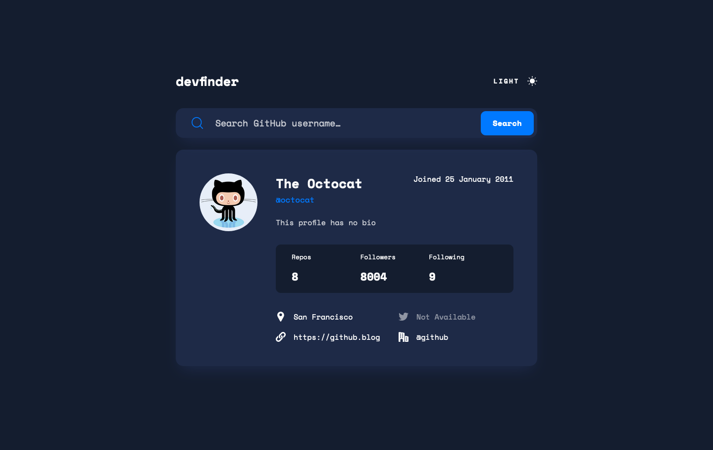

# DevFinder

This is a solution to the [GitHub user search app challenge on Frontend Mentor](https://www.frontendmentor.io/challenges/github-user-search-app-Q09YOgaH6). Frontend Mentor challenges help you improve your coding skills by building realistic projects.

| [Live Demo](https://ionstici.github.io/github-user-search-app) | [Fem Challenge](https://www.frontendmentor.io/solutions/github-user-search-app-aOWapR0PT5) |
| -------------------------------------------------------------- | ------------------------------------------------------------------------------------------ |

## About

DevFinder allows you to search for GitHub users and display their profile information in a clean, modern interface. Features dark/light theme switching and responsive design. Built using HTML, SCSS/CSS, and JavaScript.

## Features

- GitHub username search functionality
- Light/Dark theme toggle
- Responsive Design
- Location & Profile stats display

## Preview

## Credits

Design provided by [Frontend Mentor](https://www.frontendmentor.io).
