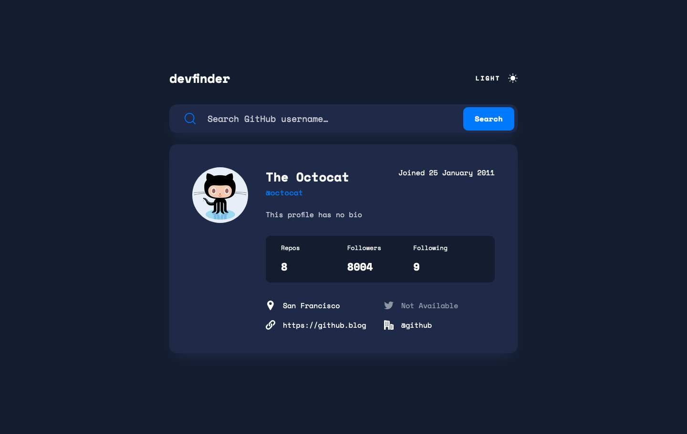

# GitHub user search app solution

This is a solution to the [GitHub user search app challenge on Frontend Mentor](https://www.frontendmentor.io/challenges/github-user-search-app-Q09YOgaH6).

## Table of contents

-   [Screenshot](#screenshot)
-   [Links](#links)
-   [Built with](#built-with)
-   [Author](#author)

## Screenshot

## Links

-   [Solution URL](https://github.com/ionStici/github-user-search-app)
-   [Live Site URL](https://ionstici.github.io/github-user-search-app)

## Built with

-   Semantic HTML5 markup
-   CSS custom properties
-   Flexbox and CSS Grid
-   Sass (Scss)
-   Mobile-first workflow
-   JavaScript and APIs

## Author

-   [GitHub](https://github.com/ionStici)
-   [Frontend Mentor](https://www.frontendmentor.io/profile/ionStici)
-   [Twitter](https://twitter.com/ionStici_)
